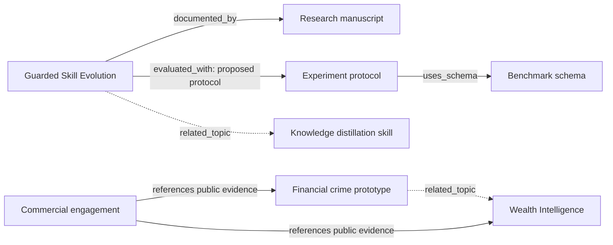

# Autumn Memo: asset memory and public command center

## Product decision

One asset can serve several purposes without being copied into separate audience
sites. Preserve the original file, assign it a stable identity, record its meaning
and relationships, and compose a visitor experience from those records.

This is a public discovery and inquiry system. It is not an authenticated personal
task manager or a payment processor. GitHub Pages remains the hosting target.

## Design tree

```text
Autumn Memo
├── Source layer — existing paths remain intact
│   ├── Blogs and legacy Hugo archives
│   ├── Markdown documents and research packages
│   ├── Interactive research HTML
│   ├── Agentic demos and browser tools
│   └── Skills, references, schemas, and supporting files
├── Asset memory layer
│   ├── Stable asset IDs and canonical source paths
│   ├── Title, summary, type, topic, audience, maturity, visibility, rights
│   ├── Source inventory and content fingerprints
│   ├── Directed relationships with an explicit basis
│   └── Commercial offers linked to one or more assets
├── Web layer
│   ├── / — command center and task entry points
│   ├── /hub/solutions/ — buyer / business problem / inquiry
│   ├── /hub/collaborate/ — researcher / collaborator / reading paths
│   ├── /hub/experience/ — employer / capabilities / technical artifacts
│   ├── /hub/library/ — learner / search / type and stream filters
│   ├── /hub/graph/ — connected assets and relationship explanations
│   ├── /hub/assets/{id}/ — stable share page and readable Markdown
│   ├── /hub/contact/ — prepare and copy/download an inquiry
│   └── /hub/design/ — interactive architecture entry points
└── Future authenticated services — separate from this public repository
    ├── Visitor memory — saved collections, annotations, reading progress
    ├── Owner memory — tasks, decisions, priorities, clients, commitments
    └── Commerce — checkout, verified events, entitlements, protected delivery
```

## Knowledge graph



The displayed graph is a focused neighborhood, not an ornamental network.
Select a node, inspect the connection basis, then open or refocus a connected
asset. A static relationship list also works without JavaScript.

`documented_by`, `evaluated_with`, and `uses_schema` refer to project structure;
`related_topic` means an editorial connection. Neither edge type asserts a
completed experiment, production deployment, or proven causal relationship.

Future relationship types should include evidence location and reviewer/date
when factual derivation is claimed. Avoid automatically converting semantic
similarity into a factual dependency.

## Source of truth and database

| Store | Responsibility | Publication |
| --- | --- | --- |
| Existing files | Authoritative source bytes | Existing URLs remain unchanged |
| `hub-src/catalog.json` | Curated meaning, stable IDs, relationships, offers | Explicit public records only |
| `data/hub/catalog.json` | Derived browser/API-friendly catalogue | Public |
| `data/hub/memory.sqlite` | Queryable asset memory and observed source revisions | Public export; contains no private records |
| `data/hub/source-manifest.json` | Fingerprints of existing nested HTML/MD outside hub tooling | Inventory; not a discovery approval list |
| Git history | Full committed content and metadata history | Repository access rules |

The SQLite database is a durable generated catalogue, not a browser database.
`assets` stores metadata; `revisions` stores first-observed timestamps per source
fingerprint; `relations` stores typed edges; `offers` and `offer_assets` describe
commercial options; `source_inventory` records source identity. Foreign keys and
indexes support graph traversal and type/stream queries.

Rebuilding preserves observed revisions for assets still in the catalogue. Removing
an asset from the catalogue removes its database row and revision observations;
Git retains committed history. Source files are never removed by the builder.

There are no embeddings or invented long-term agent memories. A future retrieval
index can add chunks with source offsets and visibility labels after access rules
and retrieval needs are defined. Prefer metadata and full-text retrieval before
introducing a vector store.

## Asset lifecycle

1. Keep the source at its existing path.
2. Add a reviewed public record to `hub-src/catalog.json` with a stable ID.
3. Add only supportable relationships, with a written basis.
4. Build the catalogue, database, and static pages.
5. Validate references, rights, maturity, and generated routes.
6. Commit the reviewed source and generated outputs together.

Publication inclusion is an explicit allowlist. The build inventories additional
HTML and Markdown but does not automatically surface raw research material or
change its visibility. In a public GitHub Pages checkout, an unlinked file may
still be public; private assets must live outside the deployed tree entirely.

## Audience and task behavior

- Buyers see potential engagements and evidence, then prepare an inquiry.
- Researchers see proposals, protocols, limitations, source readers, and sharing.
- Collaborators see concrete possible experiments and contribution discussions.
- Employers see capabilities and selected artifacts; no résumé or role claims
  are fabricated where evidence is absent.
- Learners search by topic text, asset type, and workstream; query state is in
  the URL for sharing and reloads.

All modes lead to the same canonical `/hub/assets/{id}/` pages. Original article
and demo URLs continue to function directly. Markdown readers escape raw HTML
and offer the unchanged source. The reader supports headings, paragraphs, lists,
code, and basic links; complex source formatting remains available in the original.

## Commerce model

Current offers are **inquiry-only**, without invented prices, checkout, or delivery.
The contact page copies/downloads a brief locally; it does not submit a message.
The GitHub profile is the existing verified outbound identity link.

An `available` offer requires price, currency, reviewed HTTPS checkout URL,
license URL, and delivery terms. Those fields enable a purchase action. They do
not themselves fulfill an order. Prior to enabling sales:

1. Approve the offer, rights, included artifacts, price, and support scope.
2. Configure hosted checkout with a real seller account.
3. For paid files, store bytes outside the public repository.
4. Verify payment events server-side and create idempotent entitlements.
5. Provide authenticated/signed delivery and explicit refund/support terms.

Free-to-read is not an implied reuse license. Research remains shareable through
canonical links; source licenses govern copying, redistribution, and commercial use.

## Persistence and migration boundaries

The initial refactor changes the root homepage and adds a separate hub. It does
not rewrite legacy blogs, Markdown, demos, CSS/JS used by those pages, RSS, or
the existing sitemap. `index.previous-nexus.html` retains the pre-refactor draft;
`index.legacy-hugo.html` retains the older homepage.

The checkout contained missing tracked `openmemo` files before this work. Their
absence is recorded in the preservation report. This refactor does not restore
or delete those pre-existing changes.

## Next implementation slices

1. Improve editorial summaries and verified project contribution statements.
2. Expand graph coverage from reviewed research package manifests and source links.
3. Add licensed paid bundles and real checkout only after seller configuration.
4. Add private authenticated task/visitor memory as a separate service if desired.
5. Add full-text retrieval and provenance-aware summaries after the visibility model.

## Build and verification

```sh
python3 scripts/build_hub.py
python3 scripts/validate_hub.py
node --check js/command-center.js
node scripts/test_hub_interactions.cjs
python3 -m http.server 8765 --bind 127.0.0.1
```

Generated hub files are disposable views. Edit the catalogue, builder, stylesheet,
or interaction module rather than individual generated HTML pages. Deploy the
existing repository through its normal GitHub Pages process after review.
